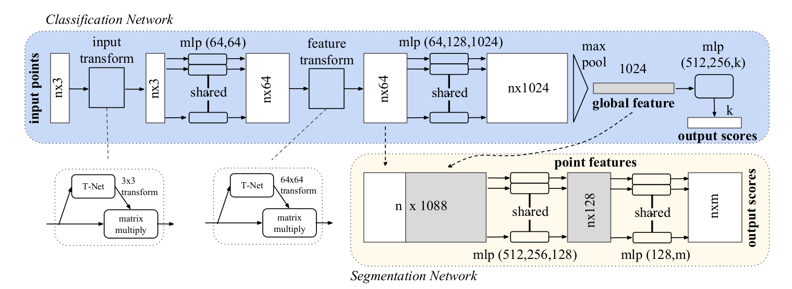

## PointNet



### ModelNet40

```bash
cd PointNet
```

下载 `modelnet40_normal_resampled` 数据集

```bash
!unzip -oq ./modelnet40_normal_resampled.zip -d .
```

然后运行

```bash
python train_cls.py
```

| model    | Acc   |
| -------- | ----- |
| official | 89.2  |
| **our**  | 89.14 |


### ShapeNet

```bash
cd PointNet
```

下载 `modelnet40_normal_resampled` 数据集

```bash
!unzip -oq ./shapenet.zip -d .
```

然后运行

```bash
python train_partseg.py
```

| *Model*  | *Instance avg IoU* | *Class avg IoU* |
| -------- | ------------------ | --------------- |
| official | 83.7               | 80.4            |
| **our**  | **84.08**          | **80.07**       |

